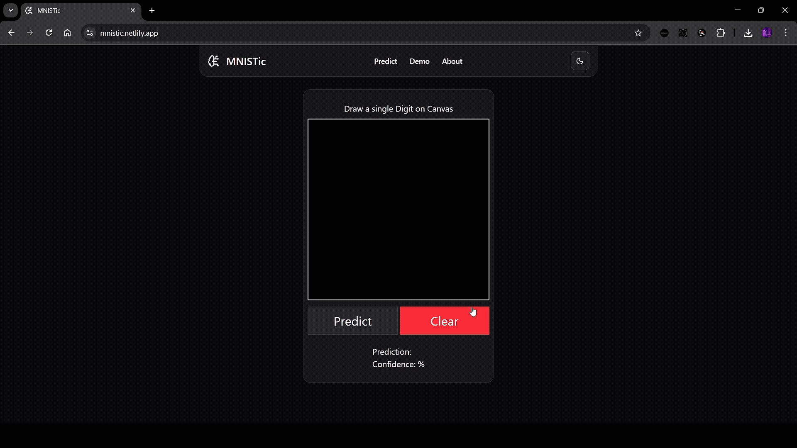

# MNISTic – Handwritten Digit Classifier



MNISTic is a fun and educational full-stack web application that lets users draw digits (0–9) on a canvas and uses a trained machine learning model to recognize them in real-time. It’s built with **Next.js** for the frontend and **FastAPI** serving a **TensorFlow Lite** model on the backend.

> ✨ Try drawing a digit on the canvas and watch the AI guess what it is!

---

## 🚀 Demo

- **Frontend**: [MNISTic Live on Netlify](https://mnistic.netlify.app)
- **Backend**: FastAPI server running locally (`localhost:8000`) or deployable to services like Render or Railway

---

## 📸 Features

- 🎨 Draw digits using an interactive canvas
- 🔎 Real-time prediction using a TFLite model
- 📱 Fully mobile responsive
- ⚡ Fast inference via optimized model (28x28 grayscale input)
- 🔁 Easily clear and redraw
- 🔒 CORS-enabled API for frontend-backend communication

---

## 🧰 Tech Stack

### Frontend

- [Next.js](https://nextjs.org/)
- [Tailwind CSS](https://tailwindcss.com/)
- React Hooks (`useRef`, `useEffect`, `useState`)
- Canvas API for digit drawing
- Axios for API calls

### Backend

- [FastAPI](https://fastapi.tiangolo.com/)
- [TensorFlow Lite](https://www.tensorflow.org/lite)
- Pydantic for request validation
- CORS Middleware for secure frontend communication

---

## 🧠 How It Works

1. You draw a digit on the canvas
2. The image is scaled to 28x28 pixels, converted to grayscale, and normalized (0–1)
3. The image data is sent to the FastAPI backend
4. A TensorFlow Lite model makes a prediction
5. The predicted digit and confidence score are returned and shown on the screen

---

## ⚠️ Limitations

- MNISTic is trained on the classic MNIST dataset — clean, centered digits.
- It may misclassify messy or off-center drawings.
- Think of this more as an educational experiment than a production-grade classifier.

We welcome you to play, break, and improve it! 🛠️

## 📬 API Example

**POST** `/predict`

```json
{
  "input_data": [0.0, 0.1, 0.9, ..., 0.0]  // 784 values normalized (28x28)
}
```

**Response:**

```json
{
  "prediction": 7,
  "confidence": 0.9952
}
```

---

## 🧠 Model Info

- Format: `digit_recognition.tflite`
- Input: `(1, 28, 28)` grayscale images
- Output: `[10]` softmax logits
- Accuracy: \~98% on MNIST validation

---

## 🙋‍♂️ Creator

Made with ❤️ by [Devansh Tyagi](https://www.linkedin.com/in/tyagi-devansh)

- GitHub: [@devanshtyagi26](https://github.com/devanshtyagi26)
- Email: [tyagidevansh3@gmail.com](mailto:tyagidevansh3@gmail.com)

---

## ✨ Acknowledgments

- [TensorFlow Lite](https://www.tensorflow.org/lite)
- [MNIST Dataset](http://yann.lecun.com/exdb/mnist/)
- [FastAPI](https://fastapi.tiangolo.com/)
- [Next.js](https://nextjs.org/)
